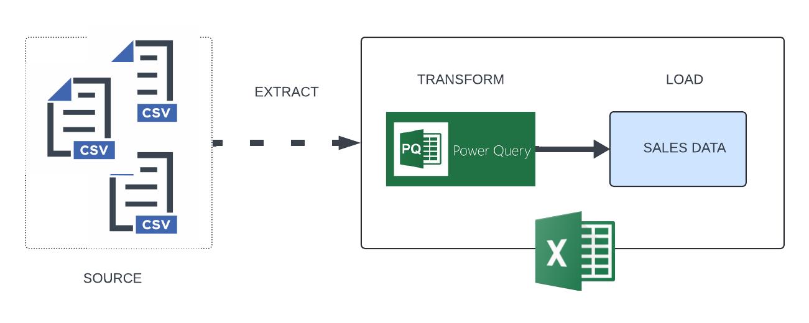
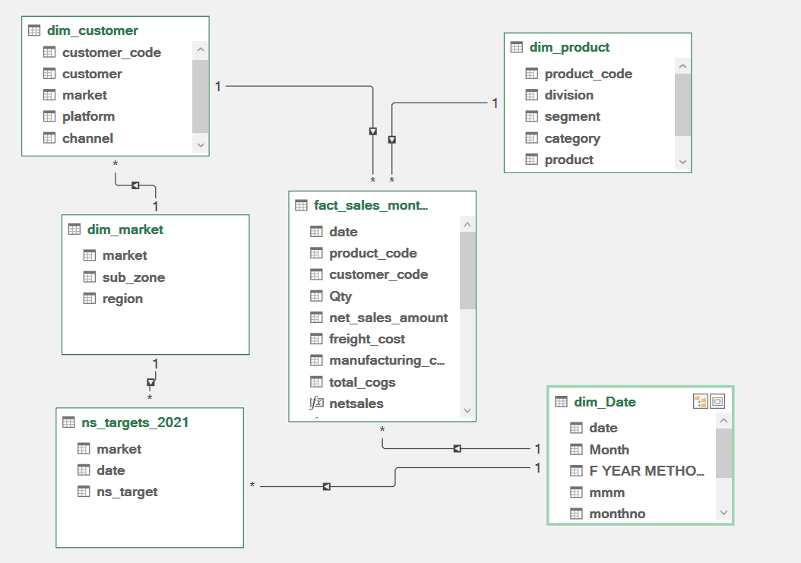
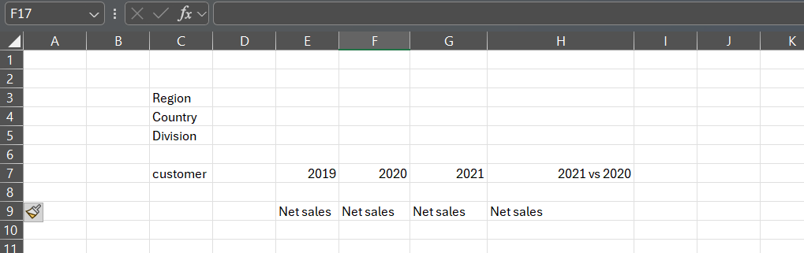

# sales-analytics-using-excel

## Introduction
The sales analytics project using Microsoft Excel involves leveraging Power Query to transform and clean data, creating data models to establish relationships between datasets, and using pivot tables to generate dynamic reports that provide insights into sales performance.

## Architecture

## Technologies Used

- **Microsoft Excel**: Analyzing and visualizing sales data.
- **Power Query**: Data extraction, transformation, and loading (ETL).
- **Data Modeling**: Managing relationships between multiple datasets.
- **Pivot Tables**: Generating dynamic sales reports.

## Dataset

The dataset used in this project contains confidential information and cannot be shared publicly. You may use a similar dataset to replicate the analysis. The project structure, including Power Query steps, data modeling, and pivot table creation, is available for reference.

## Data structure
The `dim_customer.csv` file contains the following columns:

- **customer_code**: Unique identifier for each customer.
- **customer**: Name of the customer.
- **market**: Market in which the customer operates.
- **platform**: Platform used by the customer.
- **channel**: Sales or communication channel associated with the customer.

The `dim_market.csv` file contains the following columns:

- **market**: Name of the market.
- **sub_zone**: Sub-zone within the market.
- **region**: Geographic region associated with the market.

The `dim_product.csv` file contains the following columns:

- **product_code**: A unique identifier for each product.
- **division**: The division to which the product belongs.
- **segment**: The market segment of the product.
- **category**: The category of the product.
- **product**: The name of the product.
- **variant**: Different variants or versions of the product.

The `fact_sales_monthly.csv` file includes the following columns:

- **date**: The date of the sales transaction (formatted as YYYY-MM-DD).
- **product_code**: The unique identifier for the product sold.
- **customer**: The name or identifier of the customer who made the purchase.
- **qty**: The quantity of the product sold.
- **net_sales_amount**: The total sales amount for the product, after any discounts or adjustments.

dim_date table should now be created in Excel with columns for Date and Year.

## Data modeling

## Data cleaning
- Ensure there are no missing values
- Ensure all the dimension tables contain a unique column
- Ensure there are no errors / #na in column
- check spellings randomly

## DESIGN THOUGHT PROCESS

## Business knowledge

